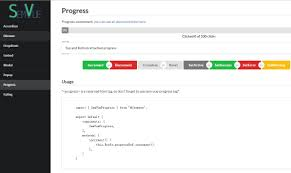

## Software Engineering Reflection
This class challenged me in many ways. The last challenge was for us to create a website of our own with a set topic. We received club hub as our project and as stressful as it was it was good fun. The most daunting task however was developing as a team. Prior to this class it’s been primarily alone work with a little side help here and there. That does not reflect the real world as you usually work with teams to get things done in a full stack development setting.

So a development environment encompasses three tiers, development server, staging server, and production server. Development server is where the test code is at and checks that for any issues before proceeding. The Staging server is an environment in which it looks exactly like the production server but it still may not work. This is a double check to see if any problem persists. Once we get past the two, we finally reach a production server in which your project is approved and deployed to a server.

First thing we did was structuring our project on paper. How will it look and how will it function? Is there a theme we want to follow? We also looked at references and figured we will focus on functionality over ui. We eventually finished and came out with a project that had more functionality. However, when we take that to the real world it won’t sell for much. How it looks also affects user flow of the website. That leads me to the problem. 

Our website is confusing, but I did learn about how to work more as a team. For example, communication is obviously key. There could be naming issues when you merge into masters or someone could be working on something similar. That’s what the Kanban board was for and I really liked that. Another thing I learned was how to avoid merge conflicts. Just update you branch from master ever so often and fix it. It was too late for us as we scrambled around to fix all these conflicts with all these various branches. 

Of course we can’t talk about development environments without a user interface framework. Semantic UI is great for developing a more modern website. User interface framework is basically a theme persay in which can be changed. Semantic UI’s goal is to “empower designers and developers”. It’s easy yet so complex that it can get jumbled up. My experience was messing around with Cards and Grids which don’t really orientate too well with each other. It definitely beats HTML so I can’t argue. With the semantic ui react website that explains the interface inherently well, you can get around with making site look professional in a short time. One gripe about it however is setting functionality to the available tag. I found myself hours on end on stack exchange trying to find a way to do something or if what I will do work. 

Overall this experience was great and I will carry what I learned throughout my career at UHM and hopefully a full stack job. Web applications is overall interesting. With the structure of development environments and working with an interface framework it sparks a new interest for me under web development. 
