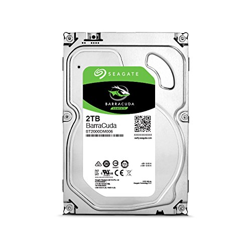

I spent about a month planning on what parts to buy for this build. The important thing to think about is compatability with the motherboard you are going to use. Second is the approximate wattage the whole system will take. Next, think how well will the hardware be together. You don't want to bottleneck any of your hardware as that will reduce optimization. Imagine funnel. The big opening represents a hardware that is contains very high specifications while thee smaller end represents the low spec. One is taking in all the water, however it ultimately slows down. For specific parts I used on this project, here is a link: https://pcpartpicker.com/user/johnbigo/saved/#view=Q4VLJx

I will not include all parts for this build explination but only will explain a few key components.

### CPU

For the CPU I chose Intel Core i7-8700 3.2 GHz 6-Core Processor. With each core being clocked at 3.2 ghz it is fast. The spread load on each core will have render speeds above average. It's not the best, however it is worth it's value.

### Motherboard

If the CPU is the brains of the operations, then the motherboard is the body. We can have all these parts but with no component having these parts work together then its all for naught. This motherboard(Asus Prime Z370-A ATX LGA1151) with an ATX form factor which is a measurment for motherboards offer 4 slots of ram with memory type DDR4 and 3 PCIE slots offering multi GPU display. 

### RAM

DDR4 Ram clocking in at 3000Ghz each stick being 8gb each. This is great for amount of processes you can have at once. Take that, Chrome!

### Storage Device

A 2 terabyte storage unit. Why so much you ask? For the sake of games. 

### M.2 SSD

This beast is the reason why my computer boots at a blink of an eye with wooping a read speed up to 3.2GB/s which is 6 times faster than the average ssd. This is due to it being attached to the motherboard via PCIE M.2 slot instead of a SATA cable.

### GPU

Last but not least, the GPU. This GPU is definitely a hefty price, but well worth the fps. This is to match my cpu and ram so that there is no or little bottleneck. The GPU affects the images displayed on your screen by having it run smoother. To hieghten this experience, you pair it up with a good monitor that has a refresh rate of 1ms and runing at 144hz then you are set. 
